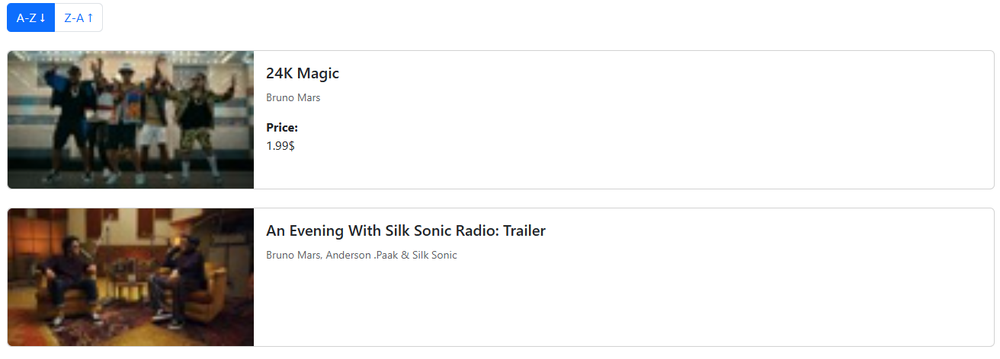
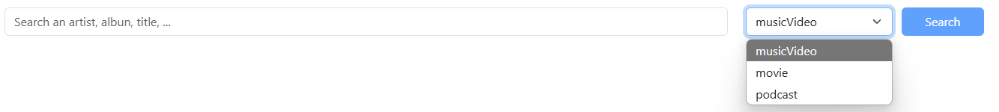

# ITunes Browser

This is a web application built with Angular 19 that allows users to search for multimedia content from ITunes such as 
songs, artists, albums, podcasts or movies. It connects to the [ITunes Search API](https://developer.apple.com/library/archive/documentation/AudioVideo/Conceptual/iTuneSearchAPI/index.html#//apple_ref/doc/uid/TP40017632-CH3-SW1) to retrieve data and displays the 
results in a paginated interface.

##### Main Features:
- Search across **music videos, podcasts, and movies**
- Results are shown in a **paginated list**, displaying **10 items per page**
- Support for **ascending or descending** sorting by track name

## Technologies Used

- **Angular 19**
- **Bootstrap 5.3.7**

## Installation and Running
Follow these steps to set up and run the project locally:

### 1. Clone the repository
Make sure you have Git installed. Run the following commands in the location where you want to clone the project:
```bash
git clone https://github.com/javier0097/itunesbrowser.git
cd itunesbrowser
```
### 2. Install dependencies
To install dependencies, run de following command. Before, make sure you have Node.js (20v+) and Angular CLI (18v+) installed.
```bash
npm install
```

### 3. Run the local server
Run the following command:
```bash
ng serve
```
Then, navigate to http://localhost:4200/ in your browser, and the application will be ready for use.

## Usage

1. **Enter a search term** in the input field (e.g., the name of an artist, collection, movie, podcast, or music video).
2. **Select a resource type** from the dropdown menu:
  - Music Videos
  - Podcasts
  - Movies
3. Click the **"Search"** button to fetch matching results.
4. The results will appear in a **paginated list**, showing **10 items per page**.

#### Notes
- If a result is missing artwork, a **default image** will be displayed instead.
- The price will not be displayed if it does not have.
- In this version, the thumbnails do not have good resolution.
- The search field must contain a term in order to perform the search.
- If the search does not return any results, a message will be displayed to indicate this.

## Project Structure

The project follows a modular and organized Angular architecture. Here's a breakdown of the main folders and files under `src/app`:
- **`app.ts`**: Root application component.
- **`app-module.ts`**: Main Angular module where components and services are declared and imported.

### 📁 components
Contains reusable UI components, grouped by feature:

- **list-card**: Handles the visual representation of individual search results.


- **search/**: Manages the search form and its interactions.


### 📁 interfaces/
Defines TypeScript interfaces that model data structures:

- `itunes-element.ts`: Interface for individual result items from the API.
- `itunes-response.ts`: Interface for the full API response structure. It has a list of `itunes-element`
- `search-params.ts`: Interface representing the search parameters sent to the API.

### 📁 services/
Contains injectable Angular services:

- `itunes.service.ts`: Encapsulates HTTP requests to the iTunes Search API and provides methods for querying multimedia content.
## Author
Javier Erick Martinez Barriga
[GitHub](https://github.com/javier0097)
